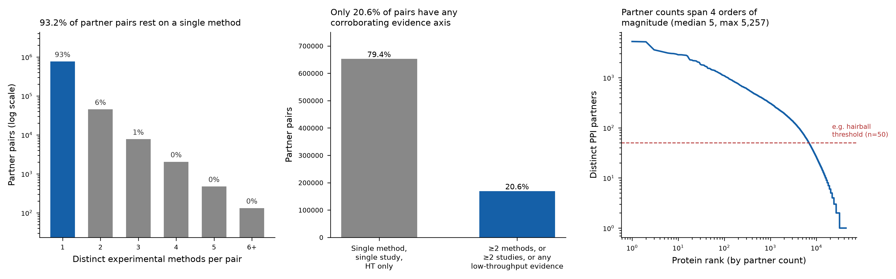

# Evaluación de la sección PPI en MLOsMetaDB: ¿filtro por cantidad de métodos?

**Fuente de datos:** `database/mlosmetadb.db`, tabla `ppi` (BioGRID, `source_version` mayormente
BIOGRID-5.0.257), 917,225 filas totales (3,367 auto-interacciones excluidas por diseño — ver
`docs/issues/004`). Se analizaron las 913,858 filas restantes, agregadas por par no dirigido
(pareja de UniProt IDs), dando **821,519 pares distintos**.

## Respuesta corta

**Sí, conviene agregar un filtro (o al menos una señal visual) por cantidad de métodos —
y la razón por la que "parecen demasiadas interacciones" es medible, no una impresión.**
El 93.2% de los pares partner-partner en la base están sostenidos por un único tipo de
método experimental, y el 79.4% dependen de un único método, de un único artículo (PubMed ID),
y solo evidencia de alto rendimiento (high-throughput). Los datos para implementar el filtro
ya viajan en la respuesta de la API (`experimental_systems`, `evidence_count`, `pubmed_ids` en
`PpiPartner`) — no hace falta tocar el schema.

## 1. Distribución de métodos por par

| Métodos distintos por par | N° de pares | % |
|---|---|---|
| 1 | 765,829 | 93.22% |
| 2 | 45,290 | 5.51% |
| 3 | 7,752 | 0.94% |
| 4 | 2,042 | 0.25% |
| 5 | 474 | 0.06% |
| 6+ | 132 | 0.02% |

La red BioPlex explora sistemáticamente el interactoma humano y contribuye una fracción sustancial de la evidencia de un solo método vía AP-MS de alto rendimiento (ver §3).

Los tipos de método en la base, por volumen de filas de evidencia:

| Método experimental | Filas de evidencia |
|---|---|
| Affinity Capture-MS | 576,264 |
| Proximity Label-MS | 164,744 |
| Affinity Capture-Western | 66,081 |
| Affinity Capture-RNA | 42,856 |
| Reconstituted Complex | 37,815 |
| Biochemical Activity | 14,197 |
| PCA | 6,044 |
| Co-purification | 4,748 |
| FRET | 2,258 |
| Co-crystal Structure | 2,218 |

De los **765,829 pares sostenidos por un único método**, el 68% (522,747) son
Affinity Capture-MS y el 18% (140,631) Proximity Label-MS — es decir, casi el 87% del
"ruido" de un solo método proviene de dos técnicas de espectrometría de masas de alto
rendimiento, ambas conocidas por generar falsos positivos por co-purificación
inespecífica más que por interacción física directa.

## 2. Robustez combinada (método + estudio + throughput)

Clasificando cada par por tres ejes de evidencia independiente:

| Categoría | N° de pares | % |
|---|---|---|
| 1 método, 1 solo PubMed ID, solo high-throughput (nivel más débil) | 652,480 | 79.42% |
| ≥2 métodos, o ≥2 estudios independientes, o alguna evidencia low-throughput | 169,039 | 20.58% |

Es decir, **4 de cada 5 pares partner-partner del panel PPI de una proteína típica
provienen de un único screen de alto rendimiento, respaldado por un único paper**.
Esto no invalida la interacción (BioGRID cura genuinamente estos datos), pero sí
implica que el panel "Partners" actual mezcla, sin distinción visual, evidencia de
confianza muy dispareja: desde una interacción confirmada por cristalografía y FRET
en múltiples laboratorios, hasta una fila de un screen proteómico masivo de un único
paper.

## 3. Concentración en unos pocos estudios de gran escala

15 PubMed IDs explican el 37.7% de toda la evidencia "débil" (single-method,
single-study, HT-only):

| PubMed ID | Filas de evidencia débil |
|---|---|
| 33961781 | 71,550 |
| 34079125 | 25,337 |
| 28514442 | 22,747 |
| 26496610 | 21,758 |
| 35271311 | 18,850 |

Estas redes proteómicas a escala del interactoma humano (p. ej. BioPlex, PMID 33961781) son screens legítimos, pero por diseño generan decenas de miles de interacciones de un
solo método — exactamente el patrón que hace que el panel de una proteína "hub" se
vea saturado.

## 4. Grados de conectividad (hubs)

| Métrica | Valor |
|---|---|
| Mediana de partners por proteína | 5 |
| Media | 37.5 |
| Máximo | 5,257 (P0DTD1, poliproteína replicasa de SARS-CoV-2) |
| Proteínas con >50 partners | 6,842 de 43,793 (15.6%) |
| Proteínas con >300 partners | 1,040 |

Los 15 hubs principales (todos con >2,700 partners) — NUDT21, PRKN, MYC, CUL3, RPA1/2/3,
VIRMA, CCNF, DHH1 y CCR4 (las dos últimas de levadura), más la poliproteína viral de
SARS-CoV-2 — son en su mayoría proteínas de unión a RNA, del complejo de replicación o
hubs de ubiquitinación, biológicamente plausibles como hubs reales, pero cuya
lista de partners es, en la mayoría de los casos, mayormente de un solo método:
p. ej. NUDT21 (96.9% single-method-weak), CUL3 (91.8%), CCR4 (98.4%), VIRMA (92.3%).
Dos excepciones notables — SUCLG2 (1.2% débil) y Q9UGI0 (0.5% débil) — están sostenidas
casi enteramente por evidencia low-throughput de un solo estudio grande de complejo
proteico, lo cual es una historia de evidencia distinta (un solo estudio muy profundo,
no un screen de alto rendimiento) y merecería su propia etiqueta si se implementa el
filtro.

Ya existe una lógica de "hairball" en el frontend (`ProteinPPI.vue`,
`INTER_EDGE_DEFAULT_THRESHOLD = 50`) que oculta aristas partner-partner por defecto
cuando hay más de 50 partners visibles — reconociendo el mismo problema de saturación
desde el lado de la visualización de grafo, pero no desde la tabla ni desde el filtro
de contenido.

## Figura

**Panel A:** distribución de pares por número de métodos experimentales distintos
(escala log). **Panel B:** fracción de pares en el nivel de evidencia más débil vs.
con algún eje corroborante. **Panel C:** distribución de grado (curva de partners por
proteína, ordenada por rango, log-log), con el umbral de 50 partners ya usado por el
frontend para ocultar aristas inter-partner.

## Recomendación concreta

1. **Agregar un filtro de "métodos ≥ N" en `ProteinPPI.vue`**, junto a los filtros
   existentes de rol y MLO. Los campos necesarios (`experimental_systems`,
   `evidence_count`, `pubmed_ids`) ya están en la respuesta de `/protein/{id}/ppi`
   (`PpiPartner`), así que es un filtro puramente de frontend (`computed` sobre
   `allPartners`), sin cambios de API ni de query SQL.
2. **No usar el conteo de métodos como único criterio** — combinarlo con "≥2 PubMed
   IDs independientes" y "tiene evidencia low-throughput", dado que un estudio único
   muy profundo (SUCLG2, Q9UGI0) es evidencia fuerte aunque use un solo método.
   Una regla simple: marcar como "alta confianza" un par con
   `n_methods≥2 OR n_pubmed≥2 OR has_low_throughput`, que separa el 20.6% robusto
   del 79.4% restante.
3. **Cambiar el filtro de rol por defecto de 'driver' a un default que no oculte
   evidencia débil silenciosamente** — hoy el filtro por defecto es rol=driver, lo
   cual ya reduce el ruido para la mayoría de las proteínas, pero no comunica al
   usuario que el 79% de lo que sí ve puede ser de un solo screen.
4. **Mostrar el conteo de métodos/estudios en la tabla**, no solo la lista abreviada
   de sistemas experimentales (`shortSystems`) — hoy la columna "Evidence" trunca a
   2 sistemas sin indicar cuántos PubMed IDs distintos hay detrás.
5. Considerar bajar el umbral de "hub" (`INTER_EDGE_DEFAULT_THRESHOLD = 50`) para el
   filtro de tabla también, no solo para las aristas del grafo, ya que el 15.6% de las
   proteínas superan 50 partners y muchas superan varios miles.

## Archivos generados

- `ppi_evidence_overview.png` — figura de tres paneles (ver arriba)
- `ppi_method_tier_summary.csv` — tabla de conteo de pares por número de métodos
- `ppi_robustness_summary.csv` — tabla de robustez combinada (método+estudio+throughput)
- `ppi_top_hub_proteins.csv` — top 50 proteínas hub con fracción de evidencia débil
