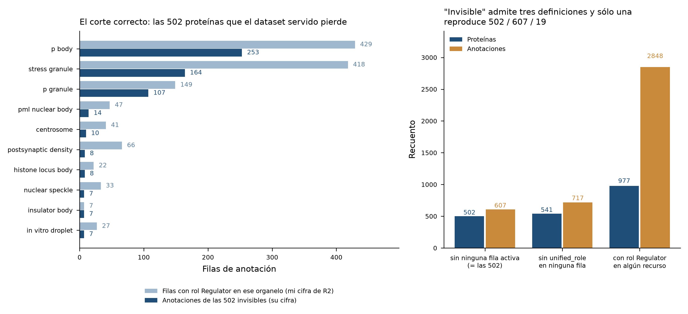
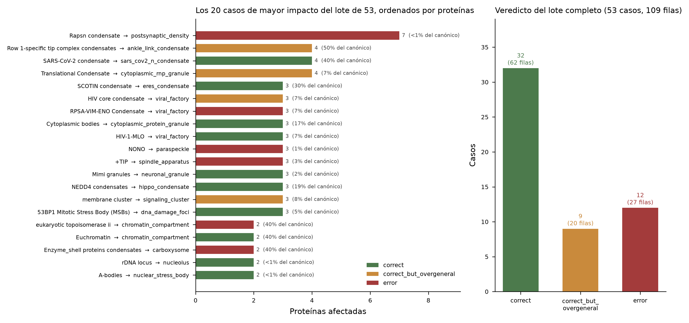
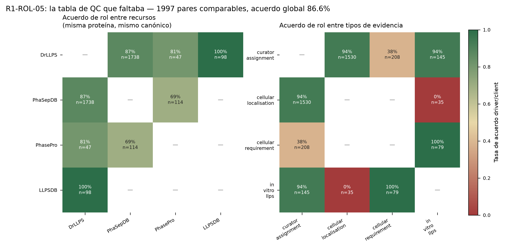
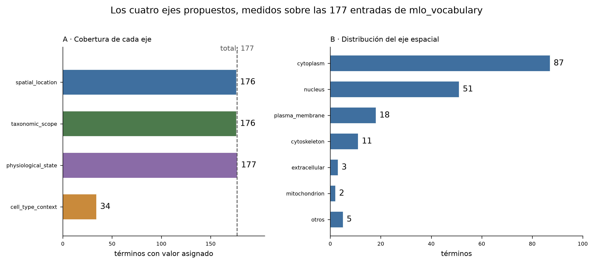
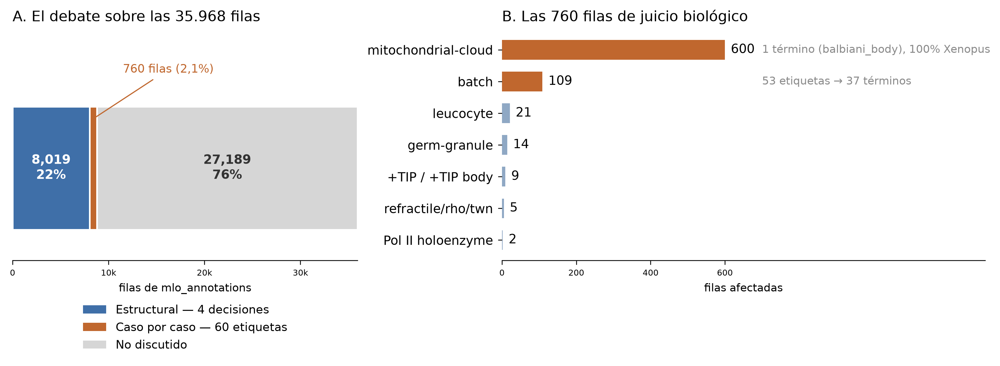

# Tercera devolución — revisión biológica de MLOsMetaDB

## Huella declarada

- `baseline._meta.generated_on_commit`: **dfc00f2** (`generated_at` 2026-08-10)
- Commit de mi copia: **trabajé sobre el archivo vivo** — copié
  `database/mlosmetadb.db` (archivo no versionado, mtime 2026-08-10 16:13:21 -03)
  a `work/mlosmetadb.db` y medí ahí. El `HEAD` del repo en el momento de medir es
  `91b2cbc`, posterior a `dfc00f2`, pero ningún commit entre los dos toca el
  pipeline de datos, de modo que las cifras absolutas son comparables.
- Remedidos por mí: `mlo_annotations` = **35.968**, `proteins` = **15.879**,
  `mlo_vocabulary` = **177**, filas sin `unified_role` = **15.233**.

Los cuatro coinciden con `dataset_baseline.json`. Verifiqué además las 35 claves
del baseline completo, no solo esas cuatro: **35 de 35 reproducen exactamente,
cero discrepancias** (`baseline_recheck.csv`). Toda cifra absoluta de este
documento está medida sobre esa copia y es directamente comparable con la de
ustedes.

El agujero que describen en el Paso 1 era real y les agradezco que lo hayan
diagnosticado así. Las 54.786 filas de la ronda 1 no eran un error de conteo mío:
eran otra base. Con la huella declarada, este problema no puede repetirse.

---

## 1. Las cifras de §1.1

Las tres correcciones que proponen son correctas. Detalle en
`figuras_1_1_recheck.csv`; acá va lo que importa, más dos hallazgos que salieron
de remedir.

**El solapamiento sináptico es entre recursos, no intra-recurso.** Mi diagnóstico
de la ronda 2 —que CD-CODE reexportaba su propia entrada de PSD— estaba mal.
De las 1.366 proteínas de la etiqueta compuesta, 1.360 tienen otra anotación a
`postsynaptic_density`, y la procedencia de esa otra anotación es DrLLPS en 1.353
casos, PhaSepDB en 13, CD-CODE en 3 y PhasePro en 1.

Pero al medirlo apareció algo que no estaba en ninguna de las dos rondas: **las
dos etiquetas de CD-CODE son disjuntas**. `Postsynaptic density` (1.483
proteínas) y `Presynaptic clusters and postsynaptic density` (1.366) tienen
intersección exactamente 0, Jaccard 0. Su unión son 2.849 proteínas, el **99,1%**
contenidas en la etiqueta `Postsynaptic density` de DrLLPS (2.859 proteínas);
Jaccard entre la unión y DrLLPS = **0,979**. Es decir: la redundancia no está
donde la buscábamos ninguno de los dos. CD-CODE particiona el compartimento
sináptico en dos etiquetas complementarias, y DrLLPS lo cubre casi entero por su
cuenta. Cuando retiren `synaptic_compartment`, la pérdida de cobertura hay que
medirla contra DrLLPS.

**Y la corroboración cruzada no es independiente.** Su argumento de que la
coincidencia entre recursos distintos es mejor evidencia que la duplicación
interna es correcto en general, pero no se aplica acá: **1.307 de las 1.353 filas
de DrLLPS** que respaldan la etiqueta compuesta llevan el PMID **23071613**, y
**916 lo llevan como único PMID**. Ese PMID es Bayés et al. 2012 (PLoS ONE),
proteoma postsináptico humano y de ratón por espectrometría de masas: un solo
experimento masivo, del que 3.336 filas de la base descienden, todas de DrLLPS.
Dos recursos que reexportan el mismo dataset no son dos fuentes. Es exactamente
el caso que `R1-INT-04` quería marcar.

**Reguladores invisibles.** Su corrección es correcta y mi cifra era de otra
cosa: 429 y 418 eran filas `Regulator` por MLO sobre las 977, no proteínas
invisibles. Con su definición —proteína sin ninguna fila con `dataset_active=1`—
reproduzco 502 proteínas, `p_body` 253 y `stress_granule` 164.

Hay una segunda lectura que conviene decidir explícitamente, porque da otra
cifra: si «invisible» significa *proteína sin ninguna anotación con
`unified_role` no nulo*, son **541 proteínas / 717 anotaciones / 28 canónicos**,
y **50 de esas filas sí están activas**. Las 502 son el subconjunto que
desaparece por completo del dataset servido; las 39 restantes están servidas pero
sin rol, que es un problema distinto y menor. Fijen una de las dos definiciones
en el libro.

---

## 2. `R1-INT-09` — `RNA polymerase II, holoenzyme`

**Veredicto: conservar el canónico y el mapeo; eliminar una fila duplicada.**

La etiqueta aporta 2 filas a `transcriptional_condensate` (220 filas / 163
proteínas): P24928 (POLR2A humana) y P11831 (RPB2 de *S. cerevisiae*), ambas con
PMID **30127355** = Boehning et al. 2018, agrupamiento del dominio CTD de Pol II
por separación de fases. El mapeo es biológicamente correcto: el CTD de Pol II es
el caso fundacional del condensado transcripcional. La holoenzima no es un MLO,
pero la etiqueta no está afirmando que lo sea; está diciendo que estas dos
subunidades participan de uno.

Lo que sí sobra es aritmética: **la misma pareja de proteínas ya entra a
`transcriptional_condensate` desde otra etiqueta del mismo recurso, con el mismo
PMID y el mismo rol**. El soporte está contado dos veces. Mi segunda devolución
la daba por «marcada para descarte» y eso era ir demasiado lejos: descartar la
etiqueta pierde el mapeo; deduplicar la fila no pierde nada.

Y esto generaliza más allá del caso. Agrupando por
`(uniprot_id, unified_mlo, source_db, evidence, unified_role)` hay **121 grupos
con más de una fila, 123 filas estrictamente removibles** sin perder una sola
afirmación (`duplicados_intra_recurso.csv`). Cualquier conteo de soporte por
proteína está hoy inflado en esos 121 pares. Una restricción `UNIQUE` sobre esa
tupla lo cierra de una vez.

---

## 3. `R2-ADJ-batch` — los 53 casos, priorizados por volumen

Adjudicados los 53 desde genes y organismos, ordenados por proteínas afectadas:
**32 correctos, 9 correctos pero sobregenerales, 12 errores**. La evidencia por
caso está en `batch53_evidence.csv` (genes, organismos, PMIDs, roles,
`evidence_type`) y el veredicto con acción en `batch53_adjudicated.csv`.

Los doce errores, por volumen:

| etiqueta fuente | canónico actual | prot | qué está mal |
|---|---|---|---|
| `Rapsn condensate` | `postsynaptic_density` | 7 | rapsina agrupa AChR en la unión neuromuscular, no en la densidad postsináptica del SNC |
| `RPSA-VIM-ENO Condensate` | `viral_factory` | 3 | agregado de superficie hospedador-patógeno, no fábrica viral |
| `NONO` | `paraspeckle` | 3 | es un nombre de gen usado como etiqueta de organelo |
| `+TIP` | `spindle_apparatus` | 3 | extremo plus del microtúbulo ≠ huso (ver §5) |
| `eukaryotic topoisomerase ii` | `chromatin_compartment` | 2 | nombre de enzima, no de organelo |
| `Enzyme_shell proteins condensates` | `carboxysome` | 2 | microcompartimento bacteriano genérico; el carboxisoma es el de RuBisCO |
| `presynaptic cytosol` | `presynaptic_active_zone` | 2 | citosol presináptico ≠ zona activa; corresponde a `synapsin_condensate` |
| `Omega speckle` | `nuclear_speckle` | 1 | el *omega speckle* de *Drosophila* es cuerpo de estrés nuclear |
| `CCR4-NOT1 complex` | `p_body` | 1 | complejo enzimático como etiqueta de organelo |
| `Plant growth regulator` | `plant_signaling_condensate` | 1 | categoría fisiológica, no organelo |
| `Trbd` | `p_granule` | 1 | dominio proteico como etiqueta |
| `BAG2` | `proteasome_foci` | 1 | nombre de gen como etiqueta |

Los nueve sobregenerales no son errores de mapeo sino de granularidad, y dos
merecen atención propia: `Row 1-specific tip complex condensates` →
`ankle_link_condensate` mapea a la estructura equivocada *dentro* del
estereocilio (el complejo de la punta no es el enlace de tobillo; conviene
renombrar el canónico a `stereocilia_tip_complex`), y `TIAR2 neuronal granule` →
`neuronal_granule` conviven con `axonal_tiar2_granule`, que es el mismo objeto
con otro nombre: unifiquen.

Un patrón que atraviesa el lote y que vale más que los casos individuales:
**siete de los doce errores son nombres de gen, de complejo o de dominio usados
como etiqueta de organelo** (`NONO`, `BAG2`, `Trbd`, `CCR4-NOT1 complex`,
`eukaryotic topoisomerase ii`, más `Actin nucleator` y `EWS-FLI1` entre los
sobregenerales). Eso no es un error de curación caso por caso: es una clase de
etiqueta que los recursos fuente emiten y que el mapeo debería rechazar de
entrada. Un filtro sintáctico —etiqueta que coincide con un símbolo de gen
conocido o con un nombre de complejo— habría levantado los siete antes de llegar
a revisión humana.

---

## 4. Los cinco hallazgos de §2.1

`R1-ROL-02`, `R1-ROL-07` e `R1-INT-02` reproducen exactamente, con las cifras que
ustedes ya midieron: 15.233/35.968 = 42,4% sin rol, con la partición CDCODE
13.844 + Regulator 1.389 = 15.233 **sin residuo**; 577/3.068 = 18,8% de drivers
desde recursos que solo emiten driver (LLPSDB 380, PhasePro 197); 214 tripletas /
182 proteínas con roles contradictorios en PhaSepDB. Sobre `R1-INT-02` su rechazo
es correcto y quiero decirlo explícitamente: con `evidence_type`, `driver` y
`client` desde los dos experimentos de PhaSepDB dejan de ser contradictorios,
porque son afirmaciones distintas. Conservar las dos filas es lo correcto.

`R1-INT-04` está a mitad de camino, como dicen. Agrego el dato que faltaba para
implementar la marca: **40 canónicos dependen de un único PMID**
(`int04_pmid_por_canonico.csv`). Pero la marca no puede computarse uniformemente:
ninguna fila de CD-CODE lleva `evidence` (0 de 13.844), así que para un canónico
de CD-CODE puro la marca correcta no es «un solo PMID» sino `membership_only`.

**`R1-ROL-05` es el único donde los objeto.** Dicen que `evidence_type` se
definió desde la tabla `(source_db, source_role)` y no desde el conjunto de
desacuerdos, y que por eso la tabla de QC no aporta. No aporta *para definir*
`evidence_type`, cierto. Aporta para algo distinto: muestra que el desacuerdo no
está distribuido, sino concentrado en un patrón que la tabla de origen no puede
mostrar.

| par | evidence_type | pares | acuerdo |
|---|---|---|---|
| DrLLPS–LLPSDB | `curator_assignment` vs `in_vitro_llps` | 98 | **1,000** |
| PhaSepDB–PhasePro | `cellular_requirement` vs `in_vitro_llps` | 79 | **1,000** |
| DrLLPS–PhaSepDB | `curator_assignment` vs `cellular_localisation` | 1.530 | 0,937 |
| DrLLPS–PhasePro | `curator_assignment` vs `in_vitro_llps` | 47 | 0,809 |
| DrLLPS–PhaSepDB | `curator_assignment` vs `cellular_requirement` | 208 | **0,385** |
| PhaSepDB–PhasePro | `cellular_localisation` vs `in_vitro_llps` | 35 | **0,000** |

El acuerdo *in vitro* contra *in vitro* es perfecto. El desacuerdo aparece
únicamente cuando PhaSepDB afirma localización y el otro recurso afirma
requerimiento — y en el par PhaSepDB/PhasePro llega a **cero sobre 35 pares**,
que no es ruido: es sistemático. Esas 35 filas son el caso de prueba obligatorio
de cualquier regla de precedencia que escriban después. Publiquen
`rol_qc_matrix.csv` junto a `evidence_type`; cuesta una tabla de seis filas.

---

## 5. Las cuatro afirmaciones de §2.4

Tres se sostienen, una no. Detalle en `adjudicaciones_2_4.csv`.

**`R2-ADJ-mitochondrial-cloud` — correcto, y más limpio de lo que dijimos.** 598
filas / 598 proteínas, todas de CD-CODE, todas en `balbiani_body`. Dije 594 de
598 *X. laevis*; en realidad son **598 de 598**. Las cuatro que parecían faltar
(B7ZPG0 = zar1.S, Q66J40, Q66KY6, Q7ZXW4) tienen `organism` NULL en la tabla
`proteins`, pero resuelven a *Xenopus laevis* en UniProt. La nube mitocondrial
del ovocito de *Xenopus* **es** el cuerpo de Balbiani: mismo orgánulo, dos
nombres, uno de ellos histórico.

**`R2-ADJ-germ-granule` — correcto para *Drosophila*, con tres filas mal
ubicadas.** Las 14 proteínas son osk, vas, tej, spn-E, me31B, pcm, smg y DCP1 de
*D. melanogaster* (gránulo polar canónico), buc, rbpms2b y tdrd6 de *D. rerio*, y
DDX3X/DDX4 humanas. Bucky ball y Tdrd6 son los organizadores del **cuerpo de
Balbiani** del ovocito de pez, no del gránulo P. Muevan esas tres filas a
`balbiani_body`, donde ya viven las etiquetas de nube mitocondrial. El resto se
queda.

**`R2-ADJ-tip-body` — acá los refuto.** Las 6 filas son BIK1, BIM1, KAR9 de
*S. cerevisiae* y mal3, tea2, tip1 de *S. pombe*: proteínas de seguimiento del
extremo plus (+TIPs). El extremo plus del microtúbulo no es el huso. KAR9 y BIM1
sí participan del posicionamiento del huso, pero mal3, tea2 y tip1 actúan sobre
microtúbulos interfásicos, donde no hay huso que hablar. El mapeo confunde una
estructura dinámica del microtúbulo con un aparato mitótico.

Lo que hace este caso barato de arreglar es que **la etiqueta hermana `+TIP` del
mismo recurso arrastra el mismo defecto al mismo canónico**: entre las dos son 9
de las 93 filas de `spindle_apparatus`. Crear `microtubule_plus_end` y mover las
nueve es **una sola tarea**, no dos, y cierra también uno de los doce errores del
lote de 53.

**`R2-ADJ-leucocyte` — correcto, y el eje de tipo celular no lo rescata.** Las 21
proteínas humanas (BRD4, MED1, DAXX, SPOP, EWSR1, TAF15, HNRNPA1, HNRNPD, MATR3,
SNRNP70, ESR1, PGR, GATA3, LMNA, TP53BP1, SP140, HSPB2, HSPB3, HABP4, KHDRBS1,
TIPARP) son componentes genéricos de cuerpo nuclear; la única con especificidad
leucocitaria es SP140. Escribí en la ronda 2 que «el esquema de ejes lo
recuperaría» y me corrijo: **no lo recupera**, porque no hay nada que recuperar.
«Leucocito» ahí nombra el sistema experimental en que se observó el cuerpo
nuclear, no un residente de tipo celular. Registrarlo como
`cell_type_context = leucocito` sería propagar la confusión al eje nuevo.

Vale la pena separarlo del caso de la unión neuromuscular del lote de 53: ahí el
calificativo *sí* es biológico (rapsina no está en la densidad postsináptica del
SNC), y por eso ese es un error de mapeo y este no lo es.

---

## 6. Los cuatro ejes

**La recomendación se sostiene. Dos de mis cifras estaban corridas y las
corrijo.**

Primera corrección: los términos cuya categoría **no** es una localización son
**56, no 55**. Germinal 16 (dije 16), Procariota 14 (14), Neuronal **9** (dije
10), Viral 5 (5), Vegetal **4** (dije 3), más Mitótico, Nuclear/Mitótico,
Autofagia, Secretor, In vitro, Patológico, Unspecified y Viral/Nuclear con 1 cada
uno.

Segunda, y más importante: los términos que **ningún** eje propuesto captura son
**cuatro, no tres**. A `liquid_dyrk3_speckle`, `midbody_granule` y
`fip200_puncta` se agrega **`mast_cell_granule`** (categoría Secretor), que
además es de lejos el mayor de los cuatro: **533 filas**. Se recupera
parcialmente vía `cell_type_context = mast_cell`, pero el proceso —secreción
regulada— se pierde. Si eso importa para la consulta que quieren servir,
`functional_process` deja de ser una columna opcional. Con esa salvedad, la
conclusión no cambia: implementen cuatro ejes.

Y para que la migración no arranque de cero, **asigné los cuatro ejes a las 177
entradas** (`axes_classification.csv`).

| eje | cubre | cómo se derivó |
|---|---|---|
| `spatial_location` | **176/177** | de la categoría v6 donde ya era una localización (121 términos); a mano desde la biología del orgánulo donde no lo era (56). Solo `NotInformed` queda `unspecified` |
| `taxonomic_scope` | **176/177** | de los organismos anotados: reino si supera el 80% de las proteínas con organismo conocido, etiqueta `pan_` si ninguno llega. Solo `rho_body` queda `sin_dato` |
| `physiological_state` | **177/177** | `constitutive` 153, `stress_induced` 10, `infection` 7, `pathological` 6, `in_vitro` 1 |
| `cell_type_context` | **34/177** | por diseño: solo donde el tipo celular es parte de la definición del orgánulo |

La distribución espacial resultante: `cytoplasm` 87, `nucleus` 51,
`plasma_membrane` 18, `cytoskeleton` 11, `extracellular` 3, `mitochondrion` 2,
`plastid` 2, y uno cada uno para `nucleus_and_cytoplasm`, `in_vitro` y
`unspecified`.

**Una advertencia antes de servir el eje taxonómico.** Es correcto pero delgado:
**63 de los 177 términos lo apoyan en 2 proteínas o menos** con organismo
conocido, y **42 en una sola**. Un eje que dice «Fungi» basado en una proteína no
es falso, pero tampoco es una afirmación de alcance taxonómico. Si lo exponen en
la API, expongan al lado el número de proteínas que lo sostienen.

---

## 7. La pregunta del eje taxonómico y `R1-ACT-17`

Preguntan si el eje derivado resuelve también `R1-ACT-17`, y si son una tarea o
dos. **La respuesta es: una tarea y media.** Los dos casos son asimétricos
(`taxonomic_axis_check.csv`).

**`refractile_body` — sí, lo resuelve solo.** Su única proteína es A0A220NKL4
(SO7 de *Eimeria tenella*). *Eimeria* es un apicomplejo: un eucariota. El eje
derivado da `Protista` y **contradice automáticamente** la categoría
`Procariota`, sin que nadie tenga que emitir un juicio biológico. Es exactamente
el tipo de error que un eje derivado del dato encuentra gratis.

**`rho_body` — no, y no por una limitación del eje.** Su única proteína es
R7KIR7, que **está borrada en UniProt** («Not part of a reference proteome») y no
tiene organismo en `proteins`. El eje derivado no puede producir nada porque no
hay dato del cual derivar. Lo único que queda es el identificador retirado,
`R7KIR7_BACT4`, cuyo sufijo apunta a Bacteroidetes; y el cuerpo de Rho se
describió en *E. coli*. O sea: la categoría `Procariota` probablemente sea
correcta, pero eso es inferencia sobre un identificador muerto, no medición.
Requiere recurar la accesión a mano o retirar el término.

De paso, el mismo procedimiento levanta **un tercer caso que no estaba en la
lista**: `twn_body` está en categoría Vegetal y sus tres proteínas (NRBP1,
TSC22D2, WNK1) son **humanas**. Si van a derivar el eje, arreglen los tres
juntos.

**Y un problema de fondo que este ejercicio destapó.** 474 de las 15.879 filas de
`proteins` no tienen organismo, y afectan 635 filas de `mlo_annotations`.
Consulté las 474 accesiones una por una contra UniProt: **201 siguen activas** y
devuelven organismo (recuperan 331 filas de anotación), **189 están DELETED** y
**84 DEMERGED**. No es staleness general de la base: en una muestra aleatoria de
200 accesiones que sí tienen organismo, **ninguna** resultó obsoleta. El problema
es específico de este bloque. Detalle, estado y remapeo en
`proteins_sin_organismo_resueltas.csv` — las DEMERGED traen destino en la columna
`remapea_a`; las DELETED no tienen ninguno. Recuperen las 201 antes de derivar el
eje taxonómico, y decidan explícitamente qué hacer con las 273 restantes.

---

## 8. Sobre el contrato de entrega

Pidieron que dijera si algo del formato hace perder información en vez de
forzarlo. Tres cosas, todas menores, y el contrato en conjunto es una mejora
clara sobre las dos rondas anteriores.

**`veredicto` no distingue «correcto pero pierde información» de «correcto», ni
«correcto» de «correcto a medias».** Son dos casos distintos y los dos aparecen.
El primero: en el lote de 53, nueve casos tienen el mapeo bien pero el término
fuente dice algo que el canónico no guarda — la distinción más útil
operativamente, porque marca dónde el eje de contexto tiene trabajo. El segundo:
`R1-ROL-07` y `R1-INT-04` están *verificados y a medio hacer*, y `confirmado`
obliga a `accion_recomendada = -`. Respeté la regla y partí cada uno en dos filas
—la respuesta como `confirmado` con `-`, y la mitad pendiente como `tipo=nuevo`—
lo cual es contract-compliant y no pierde nada, pero infla la tabla y desconecta
la acción de su hallazgo de origen. Un sexto valor
—`confirmado_parcialmente`— o permitir acción en `confirmado`, lo arreglaría.

**`prioridad` de tres valores mezcla urgencia con costo.** «Migrar a cuatro ejes»
y «retirar `synaptic_compartment`» son las dos altas, pero una toca API y
frontend y la otra es un `DELETE`. Un campo de esfuerzo separado, aunque sea
`bajo|alto`, evita que quien lea la tabla ordene por prioridad y arranque por lo
más caro.

**Un veredicto por fila del ledger no expresa las tareas conjuntas.** El caso más
claro es `R2-ADJ-tip-body`: la acción correcta cubre dos etiquetas fuente y
cierra además uno de los doce errores del lote de 53. En `verdicts.csv` eso
aparece como tres filas que dicen lo mismo con distinto `ledger_id`. Lo escribí
en la prosa de cada `accion_recomendada`, pero una columna de agrupamiento
—`tarea` con un identificador libre— lo haría legible del lado de ustedes sin
transcripción.

Lo que **no** perdí: nada del análisis. `evidencia` con la consulta y su
resultado obliga a algo que antes hacía irregularmente, y los CSVs de detalle
absorben todo lo que no cabe en una línea.

---

## 9. El alcance real del debate, y una propuesta de cierre

Antes de la lista de prioridades conviene medir cuánto de la base está
efectivamente en discusión, porque las tres rondas se sienten más extensas de lo
que el objeto justifica.

**La unión de todo lo discutido en las tres rondas son 8.558 filas (23,8%),
5.056 proteínas (31,8%) y 62 de los 177 canónicos.** Ciento quince canónicos no
aparecieron nunca en ninguna devolución.

Ese 24% se parte en dos bloques de naturaleza muy distinta:

| bloque | filas | qué es |
|---|---|---|
| **Estructural** | **8.019** | cuatro decisiones de ingeniería: retirar `synaptic_compartment` (5.872), reinstaurar Regulator (1.389), recuperar organismos (635), deduplicar (123) |
| **Caso por caso** | **760** | sesenta etiquetas fuente, cada una con su juicio biológico |

Y dentro del bloque de casos, `Mitochondrial cloud` es **600 de las 760** — y está
resuelto sin acción. **El juicio biológico pendiente son 160 filas: el 0,4% de la
base.** De los 53 casos del lote, 19 tienen **una sola proteína** y 38 tienen dos
o menos; entre esos 38 suman 45 filas.

Ahí está la asimetría que hace largo el debate: **su longitud escala con el número
de etiquetas, no con el número de filas.** Adjudicar `Trbd` (1 proteína) cuesta lo
mismo de argumentar que `Mitochondrial cloud` (598). No es un problema de la base;
es un problema del formato de la discusión.

**Propuesta: cerrar todo en esta ronda excepto los tres casos que necesitan la
publicación original.** Con esta devolución los 16 ítems que ustedes tienen en
`abierto` o `necesita_fuente` quedan así:

| ítem | qué queda | cómo cerrarlo |
|---|---|---|
| `R2-ADJ-batch` | adjudicado, 32/9/12 | aplicar acciones desde `batch53_adjudicated.csv` |
| `R1-ACT-16` (64 equivalencias) | **ninguna sin veredicto** | 2 resueltas en v5 + 9 en ronda 2 + 53 acá = 64 |
| `R2-ADJ-mitochondrial-cloud` | correcto, 100% *Xenopus* | cerrar sin acción |
| `R2-ADJ-germ-granule` | correcto, 3 filas a mover | mover buc/rbpms2b/tdrd6 |
| `R2-ADJ-tip-body` | refutado | crear `microtubule_plus_end`, mover 9 filas |
| `R2-ADJ-leucocyte` | correcto | cerrar sin acción |
| `R1-INT-09` | adjudicado | deduplicar 1 fila (+122 del mismo tipo) |
| `R2-DEC-axes` / `R1-ACT-06` | ejecutable | adoptar `axes_classification.csv` |
| `R1-ACT-17` | 1,5 tareas | derivar eje cierra 2 de 3; `rho_body` a mano |
| `R1-ACT-21b` (límite RNP) | **regla escrita** | «si hay componente de unión a ARN → `cytoplasmic_rnp_granule`»; 1 fila la viola |
| `R1-ACT-20` (vías de exclusión) | **medido** | tres vías, 403 + 1.389 filas, motivo en el 100% |
| `R1-ACT-18` (sufijos) | **vocabulario propuesto** | cinco sufijos cerrados; prohibir `complex` |
| `R1-ACT-12` (proteoma masivo) | **computado** | 9 canónicos con PMID dominante ≥50% |
| `R1-ACT-01b` (tabla de evidencia) | **dimensionado** | 3.890 PMIDs, 5.297 celdas múltiples |
| `R2-ADJ-receptor-cluster` | **sin fuente** | leer la publicación |
| `R2-ADJ-perinucleolar` | **sin fuente** | leer la publicación |
| `R2-ADJ-orc1` | **sin fuente** | leer la publicación |

Los cinco ítems de ingeniería que estaban en `abierto` sin nada medido
(`R1-ACT-01b`, `-12`, `-18`, `-20`, `-21b`) los dejo con la medición hecha y una
especificación concreta, porque en todos los casos el trabajo pendiente no era
biológico sino de dimensionamiento. Los detalles están en `verdicts.csv`; los que
más cambian algo:

- **`R1-ACT-21b`** — el límite ya funciona en la práctica. `cytoplasmic_protein_granule`
  (22 filas / 18 proteínas: APP, PRNP, HSPB2, los TRIM, SUP35, Sec16/23/24) no
  tiene **ninguna** proteína de unión a ARN; `cytoplasmic_rnp_granule` (71 / 66)
  está dominado por hnRNPs, PABPs y proteínas ribosomales. **Una sola proteína
  está en los dos**: D8V196 (cpeb4.S de *Xenopus*), y CPEB4 es una RBP, así que
  va a RNP. Las 3 filas de Sec16/Sec23/Sec24AB son COPII y probablemente no sean
  gránulo de ningún tipo.
- **`R1-ACT-18`** — el vocabulario de sufijos ya existe de hecho y está
  concentrado: `condensate` 49, `body` 42, `granule` 20, `compartment` 6 cubren
  117 de 177. Pero hay 52 sufijos distintos, con `foci`/`focus`/`puncta` como
  sinónimos (8 términos) y `complex` como el marcador sintáctico de la clase de
  error más frecuente del lote de 53. Cinco sufijos cerrados, y `complex`
  prohibido como sufijo de canónico.
- **`R1-ACT-20`** — las tres vías tienen motivo registrado en el **100%** de los
  casos, pero no son un mecanismo: `DISCARD` (17 etiquetas) y
  `synthetic_condensate` (386) excluyen **aguas arriba**, en `mlo_mapping.csv`, y
  **ninguna de las 403 llega a `mlo_annotations`**; `dataset_active=0` (1.389
  filas, todas DrLLPS/Regulator) sí está en la base pero fuera del dataset
  servido. Los motivos son de tres naturalezas —no-es-un-MLO, no-natural,
  rol-no-mapeable— y eso debería ser un campo, no tres rutas.

Si aceptan esta propuesta, la ronda 4 no es otra devolución: es **aplicar 21
acciones del lote, cuatro cambios estructurales y una migración de ejes**, más
leer tres publicaciones. Y para que no vuelva a crecer: **siete de los doce
errores del lote eran nombres de gen, complejo o dominio usados como etiqueta de
organelo.** Un filtro sintáctico sobre el mapeo elimina esa clase entera antes de
que llegue a revisión humana, que es la única forma de que la próxima ronda sea
corta.

---

## 10. Prioridad sugerida

Con lo de esta ronda incorporado, en orden de razón/costo:

1. Deduplicar las 123 filas y agregar la restricción `UNIQUE` (§2) — mecánico,
   arregla `R1-INT-09` y 120 casos más.
2. Recuperar el organismo de las 201 accesiones activas (§7) — mecánico,
   precondición del eje taxonómico.
3. Aplicar los 12 errores del lote de 53 (§3), empezando por `Rapsn condensate`.
4. Crear `microtubule_plus_end` y mover las 9 filas de `+TIP` y `+TIP body` (§5).
5. Mover las 3 filas de *Danio* de `p_granule` a `balbiani_body` (§5).
6. Retirar `synaptic_compartment` midiendo la pérdida contra DrLLPS, no contra
   CD-CODE (§1).
7. Agregar `evidence_type` con cinco valores y publicar `rol_qc_matrix.csv` al
   lado (§4).
8. Reinstaurar Regulator (§1) — recupera 502 proteínas.
9. Migrar a cuatro ejes partiendo de `axes_classification.csv` (§6) — el más
   caro; el eje taxonómico cierra `refractile_body` y `twn_body` de arrastre.
10. Recurar o retirar `rho_body` (§7) — el único que no se automatiza.
11. Crear la tabla de evidencia con clave foránea (`R1-ACT-01b`, §9) — habilita
    las marcas de `R1-INT-04` y `R1-ACT-12` sin parsear texto.
12. Leer las tres publicaciones de `necesita_fuente` (§9) — 35 proteínas, y lo
    único de toda la lista que no se resuelve desde la base.

---

## 11. Limitaciones de esta verificación

- Todo se midió sobre la copia declarada en la huella. El baseline reproduce 35
  de 35 claves, pero el archivo de la base no está versionado: si lo regeneran,
  las cifras absolutas hay que rehacerlas.
- Las 53 adjudicaciones del lote y las cuatro de §2.4 son **juicio biológico
  sobre listas de genes y organismos**, no lectura de las publicaciones
  originales. Los tres casos que ustedes tienen en `necesita_fuente`
  (`R2-ADJ-receptor-cluster`, `R2-ADJ-perinucleolar`, `R2-ADJ-orc1`) siguen
  necesitándola: no los toqué.
- El eje espacial de los 56 términos no localizacionales es asignación mía desde
  la biología del orgánulo, no derivación de un dato de la base. Es revisable
  término por término y espero que lo revisen.
- El eje taxonómico se apoya en 2 proteínas o menos para 63 de los 177 términos.
  Es la parte más frágil de lo que entrego.
